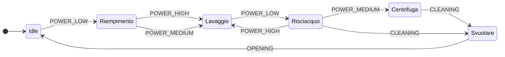
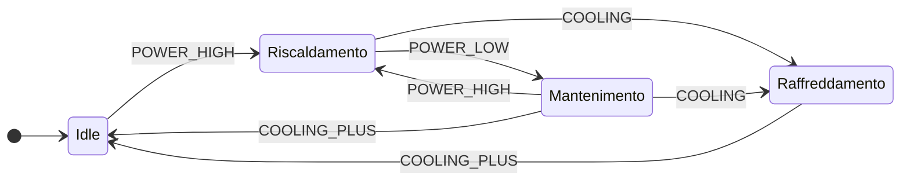

   

# ESPhome Apps for Home Assistant
Buy me a coffee</a>

### Please [support our work with a donation](https://paypal.me/hassiohelp) and star this repository! Thanks

ESPhome apps for Home Assistant [jumping2000](https://github.com/jumping2000/esphome_apps/commits?author=jumping2000) 

[![ESPhome][img-esphome]][link-esphome]

# Esphome apps works with ESPhome addon or ESPhome environment (Docker container or Python environment)

## Installation
- Install ESPhome: follow the istructions here [ESPhome](https://esphome.io), you can use [HA addon](https://github.com/esphome/home-assistant-addon) or [Docker Container](https://hub.docker.com/r/esphome/esphome) or [Python](https://esphome.io/guides/installing_esphome.html)!
- Configure secrets: [ESPhome FAQ](https://esphome.io/guides/faq.html)
- Copy **common** folder in your **ESPhome folder**
- Copy apps yaml file in your **ESPhome folder**
- Personalize the **subsitutions** section in yaml file

## Apps
-  IKEA Vindriktning
-  Plug BLITZWOLF SHP2 with FSM (Finite State Machine) to model washing machine states 

[img-hassio]:https://img.shields.io/badge/config_for-Hass.io-53c1f1.svg
[img-esphome]:https://img.shields.io/badge/config_for-esphome.io-53c1f1.svg

[link-hassio]:https://home-assistant.io/hassio/
[link-esphome]:https://esphome.io/
